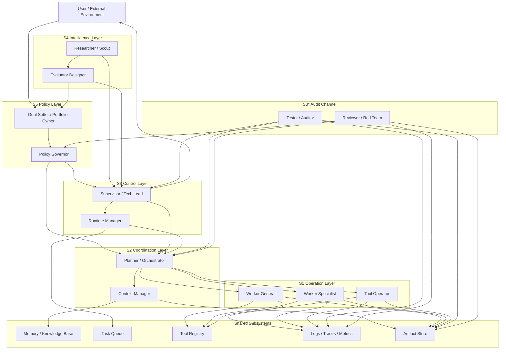

# Agentic Platform SubAgent 拓扑

## 目标

这份文档给出一版面向 `Agentic Platform` 的 `SubAgent` 拓扑设计。

重点不是罗列一批看起来合理的角色名，而是回答下面几个问题：

- 平台至少需要哪些功能层
- 哪些 SubAgent 应该独立存在
- 它们之间如何形成闭环
- 小团队最少应该保留哪些能力
- 哪些职责可以合并，哪些职责不应混在一起

本文采用 `VSM (Viable System Model)` 作为组织骨架，把 SubAgent 设计拆成 `S1 / S2 / S3 / S3* / S4 / S5` 六类功能。

## 一、设计原则

### 1. 先按功能分层，不要先按岗位命名

对于 Agentic Platform，更稳妥的做法是先回答“系统必须具备哪些功能”，再决定这些功能由多少个 SubAgent 承担。

错误做法：

- 先定义一堆岗位名，再反向找职责
- 让所有 SubAgent 都既执行、又审核、又规划
- 把“能跑起来”误当成“系统具备稳态”

正确做法：

1. 先定义执行链
2. 再定义协调与控制链
3. 再定义审计链
4. 最后定义外部感知与政策边界

### 2. 审计链必须独立

如果执行者自己证明自己“已经完成”，系统很容易长期积累伪成功。

因此需要独立的 `S3*` 通道，持续回答：

- 输出是否真的可信
- 失败路径是否被掩盖
- 指标是否失真
- 平台是否正在报喜不报忧

### 3. 外部感知不能缺失

一个只有执行与控制、没有外部感知的 Agentic Platform，短期可能稳定，长期一定失配。

因此必须保留 `S4` 能力，用来吸收外部复杂度，例如：

- 模型能力变化
- 工具链变化
- 用户需求变化
- 成本结构变化
- 安全与合规变化

## 二、VSM 到 SubAgent 的映射

| VSM 层 | 功能 | 推荐 SubAgent |
|---|---|---|
| `S1` | 执行实际任务，产出结果 | `Worker` / `Tool Operator` / `Domain Specialist` |
| `S2` | 协调多个执行单元，消除冲突与震荡 | `Planner / Orchestrator` / `Context Manager` |
| `S3` | 控制当前资源分配，维持吞吐、成本、质量稳态 | `Supervisor` / `Runtime Manager` |
| `S3*` | 绕过汇报链获取真实信号，做独立验收 | `Tester / Auditor` / `Reviewer / Red Team` |
| `S4` | 感知外部变化，规划能力演进与适应策略 | `Researcher / Scout` / `Evaluator Designer` |
| `S5` | 定义身份、边界与长期目标函数 | `Policy Governor` / `Goal Setter` |

## 三、拓扑图

## 四、各层角色说明

### S1 操作层

`S1` 是直接完成任务的执行层。

典型 SubAgent：

- `Worker General`
- `Worker Specialist`
- `Tool Operator`

职责：

- 接收任务并实际执行
- 调用工具、API、数据库或执行环境
- 产出代码、文档、分析结论或结构化结果
- 把执行痕迹写入 `logs / traces / artifacts`

注意：

- `S1` 负责做事，不负责定义全局策略
- `S1` 不应兼任独立验收者

### S2 协调层

`S2` 的职责是消除多个执行单元之间的冲突与震荡。

典型 SubAgent：

- `Planner / Orchestrator`
- `Context Manager`

职责：

- 拆解任务并分配给合适的执行单元
- 管理子任务依赖与顺序
- 管理共享上下文、记忆摘要和交接格式
- 防止多个 Worker 重复劳动、互相覆盖或丢上下文

注意：

- `S2` 的重点不是“做决策”，而是“保持协作可运行”
- 如果缺失 `S2`，多 Agent 系统通常会出现并行冲突、上下文漂移和重复执行

### S3 控制层

`S3` 负责让系统维持当前稳态。

典型 SubAgent：

- `Supervisor`
- `Runtime Manager`

职责：

- 控制资源分配
- 管理并发、队列、重试、超时和配额
- 平衡成本、时延、质量和吞吐
- 决定什么时候继续，什么时候降级，什么时候回退

注意：

- `S3` 不是纯管理展示层，而是平台的内部运营控制层
- 它需要真实状态数据，而不是汇报性摘要

### S3* 审计通道

`S3*` 是绕过正常控制链的独立事实通道。

典型 SubAgent：

- `Tester / Auditor`
- `Reviewer / Red Team`

职责：

- 独立验证输出质量
- 查找失败路径、静默错误和伪成功
- 直接读取 `logs / traces / artifacts`
- 将问题反馈给 `S2 / S3 / S5`

注意：

- `S3*` 的目标不是拖慢系统，而是防止系统在错误假设下稳定运行
- 在小团队里它可以弱化，但不能彻底消失

### S4 情报层

`S4` 负责吸收外部复杂度，并把变化转译成平台演进输入。

典型 SubAgent：

- `Researcher / Scout`
- `Evaluator Designer`

职责：

- 研究外部模型、工具和平台变化
- 维护 benchmark、回归集和能力评测框架
- 发现新的用户需求、风险和机会
- 将外部变化转译为内部待适应项

注意：

- `S4` 关心的是“外部世界发生了什么”
- 它不是当前任务执行者，也不是平台最终政策制定者

### S5 政策层

`S5` 负责定义平台身份、边界和长期方向。

典型 SubAgent：

- `Policy Governor`
- `Goal Setter`

职责：

- 定义系统目标函数
- 确定权限边界与审批规则
- 定义不可做事项和高风险动作门槛
- 平衡当前稳态优化与未来适应演化之间的张力

注意：

- `S5` 不应下沉到每个具体执行细节
- 它更像系统宪法，而不是日常 dispatch 组件

## 五、三条关键回路

### 1. 执行回路

`Planner -> Workers -> Tools -> Artifacts`

这是平台的主产出链路，决定系统是否真的能完成任务。

### 2. 控制回路

`Policy -> Supervisor -> Runtime / Orchestrator`

这是维持平台稳态的回路，决定系统在资源有限、任务波动或失败出现时是否仍然可控。

### 3. 审计回路

`Tester / Reviewer -> Logs / Artifacts -> Supervisor / Policy`

这是纠偏回路，决定平台是否会因为汇报失真而长期偏离真实状态。

## 六、最小可行部署

如果资源有限，最少应保留以下能力，不一定对应五个独立进程，但概念上不能缺：

1. `Worker`
2. `Coordinator`
3. `Supervisor`
4. `Tester / Auditor`
5. `Researcher / Policy`

对应逻辑是：

- 没有 `Worker`，系统没有产出
- 没有 `Coordinator`，多 Agent 会互相打架
- 没有 `Supervisor`，系统无法维持稳态
- 没有 `Tester / Auditor`，系统会长期伪成功
- 没有 `Researcher / Policy`，系统会逐渐与外部脱节

## 七、建议的第一版落地配置

如果要做一版真正可运营的 `Agentic Platform`，建议先落以下 8 类 SubAgent：

1. `Planner-Orchestrator`
2. `Context Manager`
3. `Worker-General`
4. `Worker-Specialist`
5. `Tool-Operator`
6. `Supervisor / Runtime Manager`
7. `Tester / Auditor`
8. `Researcher / Policy`

这样做的原因：

- 角色数还可控
- 已经具备执行、协调、控制、审计和外部感知五种核心能力
- 能支持从单任务系统向平台系统演进

## 八、哪些职责不应混在一起

下面这些职责即使在小平台里合并实现，也应在设计上保持清晰边界：

### 1. Worker 和 Tester

冲突点：

- 一个负责尽快产出
- 一个负责独立找错

如果完全合并，系统容易把“能跑”误当成“已验证”。

### 2. Supervisor 和 Auditor

冲突点：

- 一个负责维持当前稳态
- 一个负责揭示当前稳态中的真实缺陷

如果完全合并，平台容易只留下对自己有利的状态解释。

### 3. Runtime / Operator 和 Policy

冲突点：

- 一个负责执行动作
- 一个负责决定什么动作不应被执行

如果完全合并，高风险动作的边界会变得模糊。

### 4. Current Optimization 和 Future Adaptation

也就是 `S3` 与 `S4` 的边界。

冲突点：

- 一个追求当下效率
- 一个追求未来适应性

如果完全用同一个目标函数衡量，两者之一会长期被压制。

## 九、落地时常用检查清单

在设计或评审一套 Agentic Platform 时，至少过一遍以下问题：

- 是否已经区分执行层、协调层、控制层、审计层、情报层、政策层
- 是否存在独立的审计通道
- 是否有真实的外部变化输入，而不只是内部日志
- 是否有共享基础设施承载记忆、任务、工件和观测数据
- 是否明确哪些角色必须独立，哪些角色只是暂时合并
- 是否定义了高风险动作的审批或阻断边界
- 是否存在“执行成功但语义错误”的检测机制
- 是否能从单任务演进到多任务、多租户或多域场景

## 十、一句话原则

Agentic Platform 的核心不是堆更多 `Worker`，而是：

**同时具备执行、协调、控制、审计、外部感知和政策约束六类能力，并让它们形成闭环。**
